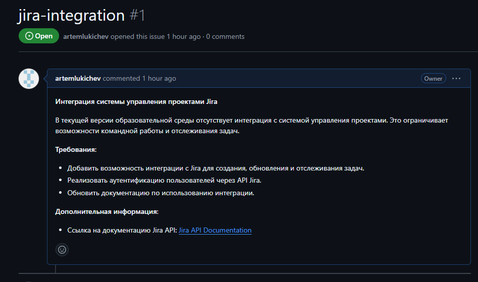
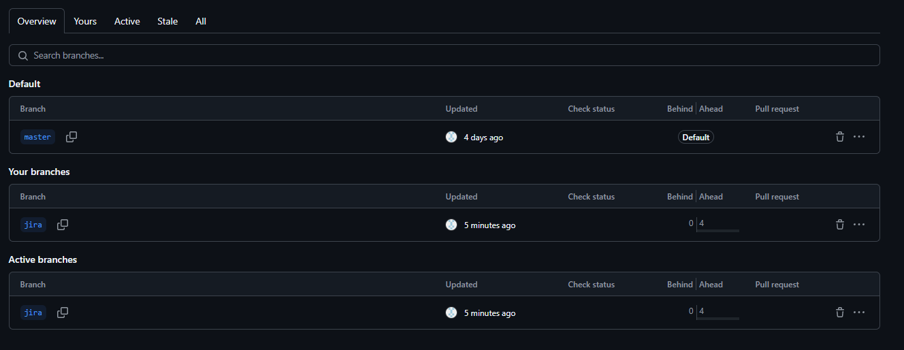
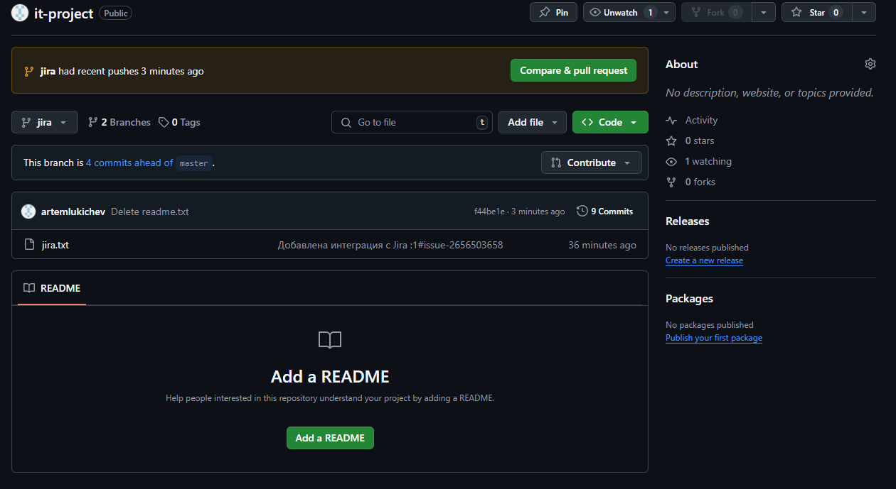
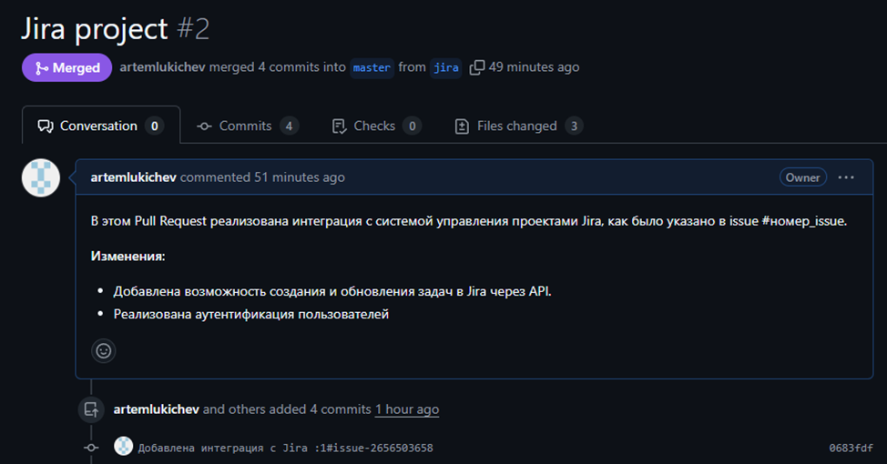
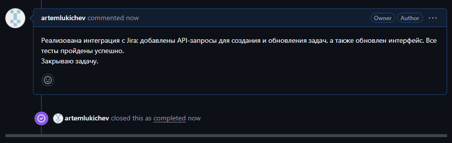

###### Изучив конкретную систему управления IT-проектами корпоративного обучения, использовав одну из стратегий ветвления (branching strategies) на основе сервиса GitHub реализовать добавление функции в существующем программном IT-проекте веб-ориентированной компоненте образовательной среды, предварительно создать запрос на добавление функционала (issue), спланировать временные затраты. Оформление отчета по результатам работы и презентации или одностраничного сайта с основными результатами.

------------
## Интеграция системы управления ИТ-проектами JIRA
### Введение
Для реализации интеграции среди всех систем управления ИТ-проектами была выбрана JIRA. Эта система выделяется среди аналогов благодаря своей гибкости, масштабируемости и возможности интеграции с другими информационными системами через REST API.

### Стратегия ветвления
В качестве стратегии ветвления было принято решение использовать **Feature Branching** (ветвление для функциональности). Данная стратегия предполагает создание отдельной ветки для каждой новой функции или задачи, что позволяет разработчикам одновременно работать над различными функциональными возможностями, не мешая основной ветке разработки. После завершения работы созданная ветка может быть объединена с основной через Pull Request.

## Шаги проведения интеграции
### 1. Создание issue проекта



### 2. Создание ветки для новой функции

```bash
git checkout -b jira 
::Switched to a new branch 'jira'
git add .

```
### 3. Реализация функции
Внесены необходимые изменения доработки (файл `jira.txt`). 
Коммит и пуш изменений:

```bash
git commit -m "Добавлена интеграция с Jira :1#issue-2656503658"
git push origin jira
```



### 4. Запрос на принятие изменений
Выполнен Pull Request:


### 5. Слияние
После согласования изменений выполнено слияние в основную ветку. 
Ниже продемонстрирован результат слияния с основной ветвью.


### 6. Закрытие issue
После успешного слияния закрываем проблему, изменив статус issue:


## План интеграции
### 1. Подготовительный этап (1-2 недели)
- **Анализ требований (3-5 дней)**
  - Изучение потребностей бизнеса
  - Проведение встреч с заинтересованными сторонами для сбора требований
- **Изучение текущих процессов (3-5 дней)**
  - Анализ существующих подходов к управлению проектами
  - Определение узких мест и возможностей для оптимизации
- **Выбор инструментов и плагинов (2-3 дня)**
  - Исследование доступных интеграций и плагинов для JIRA

### 2. Проектирование (1 неделя)
- **Создание архитектуры интеграции (3-5 дней)**
  - Определение структуры проектов, задач и рабочих процессов в JIRA
  - Разработка схемы интеграции с другими системами (например, CI/CD и тестированием)
- **Подготовка документации (2-3 дня)**
  - Составление документации по архитектуре и процессам интеграции

### 3. Реализация (2-4 недели)
- **Настройка JIRA (5-10 дней)**
  - Создание проектов, задач и рабочих процессов
  - Настройка прав доступа и ролей пользователей
- **Интеграция с другими системами (5-10 дней)**
  - Разработка и тестирование API-интеграций
  - Настройка автоматизации процессов (например, уведомлений и триггеров)
- **Тестирование интеграции (5-7 дней)**
  - Проведение функционального тестирования
  - Исправление ошибок и доработка интеграции

### 4. Обучение и внедрение (1-2 недели)
- **Обучение пользователей (3-5 дней)**
  - Проведение тренингов для сотрудников по работе с JIRA
  - Подготовка обучающих материалов и руководств
- **Внедрение системы (3-5 дней)**
  - Переход на новую систему управления проектами
  - Поддержка пользователей в процессе адаптации

### 5. Поддержка и оптимизация (1 неделя)
- **Сбор обратной связи (2-3 дня)**
  - Опрос пользователей о работе с новой системой
  - Определение проблем и возможностей для улучшения
- **Оптимизация процессов (2-3 дня)**
  - Внесение изменений на основе собранной обратной связи

## Общая оценка временных затрат
- **Итого**: 6-10 недель (в зависимости от сложности существующей информационной системы).

###### Заключение
Данный план интеграции позволит эффективно реализовать проект с учетом всех вышеуказанных этапов, обеспечивая качественное управление ИТ-проектами и полноценную работу команды.

------------
------------


### Презентация Feature Branching

#### Введение

- **Тема**: Feature Branching
- **Автор**: Артём Лукичев, кэо 2к

---

#### Что такое Feature Branching?

- Стратегия ветвления в системах контроля версий
- Позволяет разработчикам работать над новыми функциями и задачами независимо
- Снижает риск конфликтов при интеграции

---

#### Преимущества Feature Branching

- **Изоляция изменений**: Каждый разработчик работает над своей функцией в отдельной ветке.
- **Упрощение тестирования**: Легче тестировать и разрабатывать функции независимо.
- **Безопасность основной ветки**: Основная ветка всегда остается стабильной.

---
#### Как работает Feature Branching?

1. **Создание Issue**: Определение новой функции или задачи.
2. **Создание ветки**: Использование `git checkout -b feature/имя_функции`.
3. **Разработка**: Внесение изменений и коммит.
4. **Pull Request**: Запрос на слияние ветки с основной.
5. **Слияние**: Интеграция изменений в основную ветку после ревью.
6. **Закрытие Issue**: Завершение задачи.

---
