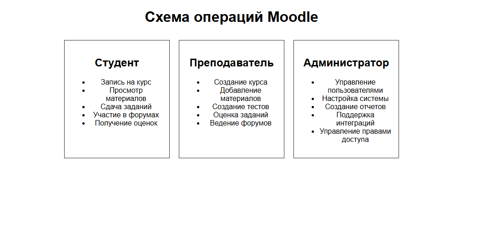

###### Анализ функциональности инструмента профессионального решения образовательных задач и создание схемы с описанием операций, основных действующих лиц, которые эти операции могут выполнять. Предварительная оценка состава команды для разработки аналогичного инструмента, их ролей, сроков, задач для реализации.

------------

## Анализ функциональности инструмента для образовательных задач: Moodle

Moodle — это популярная платформа для управления обучением (LMS), используемая многими образовательными учреждениями по всему миру. Она предлагает множество функций, поддерживающих процесс обучения. 

### Основные функции Moodle:

1. **Управление курсами**:
   - Создание и управление курсами.
   - Возможность добавления различных типов материалов (видео, текст, тесты и т.д.).

2. **Оценка и оценивание**:
   - Создание тестов и заданий с автоматизированным оцениванием.
   - Возможность выставления оценок и предоставления обратной связи.

3. **Коммуникация**:
   - Форумы для обсуждений.
   - Возможности для обмена сообщениями между пользователями.

4. **Отчеты и аналитика**:
   - Генерация отчетов о посещаемости и успеваемости студентов.
   - Аналитика по взаимодействию пользователей с курсами.

5. **Интеграция**:
   - Поддержка интеграций с внешними сервисами и инструментами.

## Схема операций

[Схема в html](pic/var3.html "Схема в html")

### Основные действующие лица и их операции:

#### Студент
- Запись на курс
- Просмотр материалов
- Сдача заданий
- Участие в форумах
- Получение оценок

#### Преподаватель
- Создание курса
- Добавление материалов
- Создание тестов
- Оценка заданий
- Ведение форумов

#### Администратор
- Управление пользователями
- Настройка системы
- Создание отчетов
- Поддержка интеграций
- Управление правами доступа

## Предварительная оценка состава команды для разработки аналогичного инструмента

### 1. Состав команды:
- **Проектный менеджер (1)**:
  - Ответственен за планирование и координацию работы команды.

- **Бизнес-аналитик (1)**:
  - Анализ требований пользователей и составление спецификаций.

- **UX/UI дизайнер (1-2)**:
  - Разработка пользовательского интерфейса и опыта.

- **Backend разработчики (2-3)**:
  - Создание логики приложения и работа с базами данных.

- **Frontend разработчики (2-3)**:
  - Реализация пользовательского интерфейса и взаимодействий.

- **Тестировщики (1-2)**:
  - Проведение тестирования и обеспечение качества программного обеспечения.

- **Специалист по интеграциям (1)**:
  - Работа с API внешних сервисов и интеграция с платформами.

### 2. Сроки разработки:

- **Сбор требований**: 2-3 недели
- **Дизайн**: 2-3 недели
- **Разработка**: 3-6 месяцев (в зависимости от сложности)
- **Тестирование**: 4-6 недель
- **Запуск и обучение пользователей**: 2-4 недели

### 3. Задачи для реализации:

- Сбор и документирование требований к функционалу платформы.
- Проектирование прототипов интерфейса.
- Разработка архитектуры системы и создание баз данных.
- Разработка как серверной, так и клиентской части приложения.
- Интеграция с внешними системами и настройка API.
- Проведение тестирования (функционального, интеграционного и пользовательского).
- Обучение пользователей и подготовка документации.
